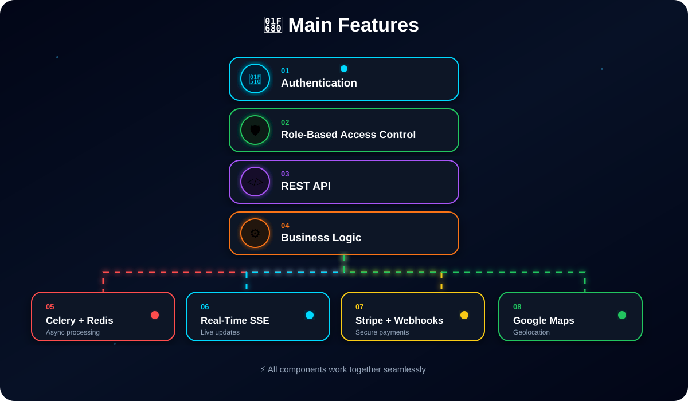

<h1 align="center">
  Hi, I'm Oussama
  
</h1>

<p align="center">
  <strong>Full Stack Developer — Backend, APIs & Modern Web Applications</strong>
  <br>
  Building modern, scalable & high-performance web solutions.
</p>

<p align="center">
  
</p>

<p align="center">

<a href="https://github.com/OussamaGhazi12">

</a>

<a href="https://www.linkedin.com/in/oussama-ghazi/">

</a>

<a href="mailto:oussama.ghazi2003@gmail.com">

</a>

</p>

---

# 👨‍💻 About Me

I'm a **Technicien Spécialisé en Développement Informatique**, focused on
**Backend & Full-Stack Development**.

I build modern, scalable and secure web applications with a strong focus on:

- 🚀 REST API development
- ⚙️ Backend architecture
- 🔄 Asynchronous processing
- 📡 Real-time systems
- 🔐 Authentication & authorization
- 💳 Payment integrations
- 🐳 Docker & deployment
- 🎨 Modern responsive interfaces
- 🗄️ Database design and optimization

I enjoy solving real-world problems, designing clean architectures and
continuously improving my development skills.

---

# 🛠️ Tech Stack

## 💻 Frontend


---

## ⚙️ Backend & Frameworks


---

## 🗄️ Databases & Caching


---

## 🔌 API & Integrations


---

## ⚡ Asynchronous & Real-Time


---

## 🔐 Security


- JWT Authentication
- Role-Based Access Control
- Roles & Permissions
- Secure API Authentication
- Stripe Webhooks

---

## 🐳 DevOps & Version Control


- Docker Containerization
- Git Version Control
- GitLab
- Deployment
- CI/CD Fundamentals

---

## 🧪 Testing & Tools


---

# 🏗️ Architecture & Methodologies

- 🧩 MVC
- 🧩 MTV
- 🏛️ Repository Pattern
- 🧼 Clean Architecture
- 🔌 REST API Architecture
- 🔐 RBAC
- 🔑 JWT Authentication
- 🔗 API Resources
- 🪝 Webhooks
- ⚡ Asynchronous Processing
- 📡 Real-Time Systems
- 📐 UML
- 🔄 Agile / Scrum

---

# 🚀 Main Features

<p align="center">



</p>

---

# 📂 Featured Projects

## 🔹 Kargo — Logistics Platform

Full-stack logistics platform developed during my Backend / Full-Stack
development internship.

### Backend

- 🐍 Python / Django
- 🔌 Django REST Framework
- 🔐 RBAC
- 💳 Stripe Payments
- 🪝 Stripe Webhooks
- ⚡ Celery Workers
- 🔴 Redis
- 📡 Server-Sent Events
- 🌐 ASGI / Daphne
- 🗺️ Google Maps Platform
- 🐘 PostgreSQL
- 🐳 Docker
- 🧪 Insomnia API Testing

### Main Features

- Authentication
- Role-Based Access Control
- REST API
- Business Logic
- Asynchronous Workers
- Real-Time Updates
- Secure Payments
- Geolocation

---

# 🌐 WordPress Custom Theme + Kommo API

A complete company website developed for **INSPIRIGENCE**.

### Features

- 🌐 Custom WordPress Theme
- 🎨 Frontend + Backend
- 📩 Persistent Contact Form
- 🔌 Kommo API Integration
- 📊 Admin Dashboard
- 🔎 Lead Management
- 📤 CSV / Excel Export
- 🎨 UX Improvements
- 🚀 Deployment & Optimization

---

# 🔧 Garage Management System

Modern management platform built with **Laravel + React**.

### Features

- 📅 Reservation Management
- 📦 Product Management
- 🗂️ Categories
- 🔎 Filters
- 👨‍💼 Admin Panel
- 🔌 REST API Communication
- ⚛️ React Frontend
- 🔥 Laravel Backend

---

# 🧩 Advanced Laravel API Starter

Reusable backend architecture for scalable Laravel applications.

### Features

- 🔐 JWT Authentication
- 🏛️ Repository Pattern
- 🧼 Clean Architecture
- ⚠️ Custom Exceptions
- ⚡ Rate Limiting
- 🚀 Caching
- 🔌 REST APIs
- 📦 API Resources
- 🗂️ Clean Folder Structure

---

# 📊 GitHub Stats

<p align="center">

  

  

</p>

---

# 💻 Most Used Languages

<p align="center">

  

</p>

---

# 📈 GitHub Activity

<p align="center">

  

</p>

---

# 🎯 Current Focus

<div align="center">

```text
┌──────────────────────────────┐
│     🚀 BACKEND DEVELOPMENT   │
└──────────────┬───────────────┘
               ↓
┌──────────────────────────────┐
│ 🐍 Django / Django REST API  │
└──────────────┬───────────────┘
               ↓
┌──────────────────────────────┐
│ 🔌 Advanced REST APIs        │
└──────────────┬───────────────┘
               ↓
┌──────────────────────────────┐
│ ⚡ Async Processing           │
└──────────────┬───────────────┘
               ↓
┌──────────────────────────────┐
│ 🔴 Celery + Redis            │
└──────────────┬───────────────┘
               ↓
┌──────────────────────────────┐
│ 📡 Real-Time Systems         │
└──────────────┬───────────────┘
               ↓
┌──────────────────────────────┐
│ 🐳 Docker & DevOps           │
└──────────────┬───────────────┘
               ↓
┌──────────────────────────────┐
│ ☁️ Scalable Applications     │
└──────────────────────────────┘
